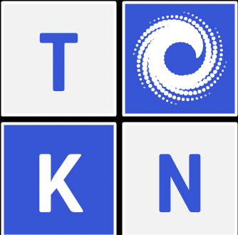

<div id="top"></div>
<!--
*** Thanks for checking out the Best-README-Template. If you have a suggestion
*** that would make this better, please fork the repo and create a pull request
*** or simply open an issue with the tag "enhancement".
*** Don't forget to give the project a star!
*** Thanks again! Now go create something AMAZING! :D
-->

<!-- PROJECT SHIELDS -->
<!--
*** I'm using markdown "reference style" links for readability.
*** Reference links are enclosed in brackets [ ] instead of parentheses ( ).
*** See the bottom of this document for the declaration of the reference variables
*** for contributors-url, forks-url, etc. This is an optional, concise syntax you may use.
*** https://www.markdownguide.org/basic-syntax/#reference-style-links
-->

<!-- PROJECT LOGO -->
<br />
<div align="center">

<div align="center">
  <a href="./src/TokenSquareLogo.png">
    
  </a>

<h3 align="center">Token Square Frontend</h3>

  <p align="center">
    Front end for the Token Square project for the ConsenSys Hackathon
  </p>
</div>

### Built With

[React.js](https://reactjs.org/)
[Victory](https://formidable.com/open-source/victory/)
[TailwindCSS](https://tailwindcss.com/)

<p align="right">(<a href="#top">back to top</a>)</p>

<!-- GETTING STARTED -->

### Installation and Starting

Clone the repo
   ```sh
   git clone https://github.com/BZahory/token-square-graph.git
   cd token-square-graph
   ```
 Install NPM packages
   ```sh
   npm install
   ```
Start the app
   ```sh
   npm start
   ```

<p align="right">(<a href="#top">back to top</a>)</p>

### Project Links

[DevPost](https://devpost.team/consensys/projects/205)
[Google Slides](https://docs.google.com/presentation/d/1hWNE44GGR4F-61MSKHURvx47xAlYJMvIpEn6IqCmRQk/edit?usp=sharing)
